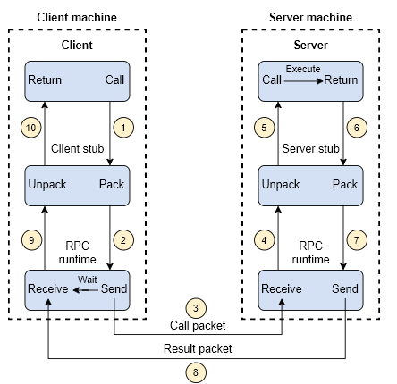
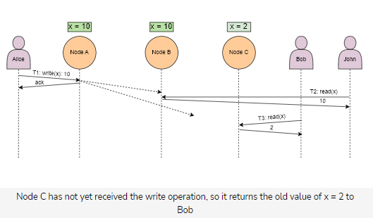

- [Introduction](#introduction)
- [Interview](#interview)
- [Abstractions](#abstractions)
  - [network abstractions: _Remote_ procedure calls (RPCs)](#network-abstractions-remote-procedure-calls-rpcs)
  - [consistency models](#consistency-models)
  - [failure models](#failure-models)
- [Non-functional system characteristics](#non-functional-system-characteristics)
- [Back-of-the-envelope numbers](#back-of-the-envelope-numbers)

# Introduction

> system design = process of defining components, APIs and data models to build large scale system

- targets
  - effective = meets requirements
  - maintainable = flexible to change (e.g. scale, add features)
  - reliable = little downtime = handles errors (which will always occur!)
- system building blocks (in this course 16)
  - load balancer
  - ...
- recommended prerequesite:
  - distributed systems
    - https://www.educative.io/courses/distributed-systems-practitioners
  - computer networking
  - operating systems

# Interview

- recommended steps
  - solidify requirements
  - scope problem (i.e. which features are left to focus on core)
  - let interviewer take part in thought process
- recommended strategy
  - 1. Ask refining questions
    - put on product manager hat and prioritize requirements
    - split requiremenst into
      - direct/functional ones (e.g. ability to send messages in real-time)
      - indirect/nonfunctional ones (e.g. messaging performance shouldn't degrade with high load)
  - 2. Understand data characteristics
    - size, read-write-speed, consistency, durability, regulatory requirements, ...
    - how will data be consumed by subsystems or end users?
  - 3. Discuss components
    - which to pick, where to place, how they interact
  - 4. Discuss trade-offs
    - each choice has pros and cons, discuss them and your pick.
    - e.g.: current system has low costs, but cannot scale 10x load
      - mitigate shortcoming via monitoring load and scale-up-plan

# Abstractions

> Abstractions in distributed systems help engineers simplify their work and relieve them of the burden of dealing with the underlying complexity of the distributed systems.

## network abstractions: _Remote_ procedure calls (RPCs)

- = e.g. client sends command via RPC runtime to a server, where command is executed and result returned to client
- RPC runtime is responsible for (re)transmissting, acknowledging and encrypting messages

## consistency models

Consistency is relevant in database and distributed systems:

- ACID consistency in databases
  - ACID = Atomicity, _Consistency_, Isolation, and Durability
  - = ensures that values are unique
- CAP theorem (also "Brewer's theorem") in distributed systems
  - CAP = _Consistency_, Availability, Partition tolerance
  - every replica has same value at all times (e.g. for read operations)

There are four levels of consistency. In general, the more consistent, the less performant/available.

- Eventual consistency
  - = all replicas will return same value **eventually**
  - PRO: high availability
  - EXAMPLE: domain name system
- Causal consistency
  - = ensures order of _causally related_ operations
    - (e.g. if `b@y = x@a +5`, then `x=read(a)` happens before `y=write(b)`)
  - EXAMPLE: commenting systems such as facebook
- Sequential consistency
  - = preservers ordering (specified by client's program?!)
- Strict consistency ("linearizability")
  - = acknowledgement not sent until new value written to all replicas
  - CON: affects system's availability negatively
  - EXAMPLES:
    - updating password of bank account
    - Amazon Aurora relational database

The system below has not strict consistency, because the `ack` is sent before all replicas have updated the value. Indeed, Bob reads an old value.

## failure models

- fail-stop
  - node halts permanently
  - other nodes can still detect that node (and that it stopped?!)
  - PRO: simple and most convenient failure mode
- crash
  - node halts silently
  - other nodes can't detect that node stopped working
- omission failure
  - node fails to send or receive messages
- temporal failure
  - node sends correct result, but too late
- Byzantine failure
  - node exhibits random behavior (e.g. arbitrary times, arbitrary messages, ...)
  - often happens due to a malicious entity or bug

# Non-functional system characteristics

- `availability = (total_time - down_time) / total_time`
  - Note: `down_time` measured differently (only some clients? planned downtime?)
- reliability = probability that service performs correctly
  - METRIC: mean time between failures
- scalability
  - in terms of request workload / storage workload
  - vertical vs. horizontal scalability
- maintainability
  - consists of...
    - operability = ease of operation
    - lucidity = simplicity of code
    - modifiability = ease of change
  - METRIC: mean time to repair
- fault tolerance
  - ability of system to execute even if one or more components fail
  - techniques
    - replication (consistency -> availability!)
    - checkpointing

# Back-of-the-envelope numbers

- approximate numbers are required
  - EXAMPLE: choose between server alternatives (e.g. webserver vs application-server vs storage-server)
  - EXAMPLE: estimate whether request-rate of server is CPU- or memory bound
    - `parallel_requests_CPU=CPU_thread_count=72`
    - `parallel_requests_mem=total_mem_size/request_mem_size=800`
    - `request_rate=parallel_requests_count/task_time`
  - EXAMPLE: How many servers needed for 500E6 users making 20 requests/day?
    - INFO: since requests are passed between servers, therefore scale up!
    - They make assumption that 1 server = 8000 requests/s = 8000 users/d ?!?!
  - EXAMPLE: storage, bandwidth straightforward
